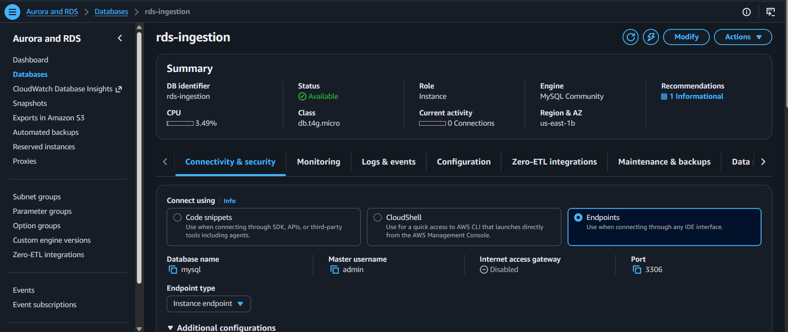
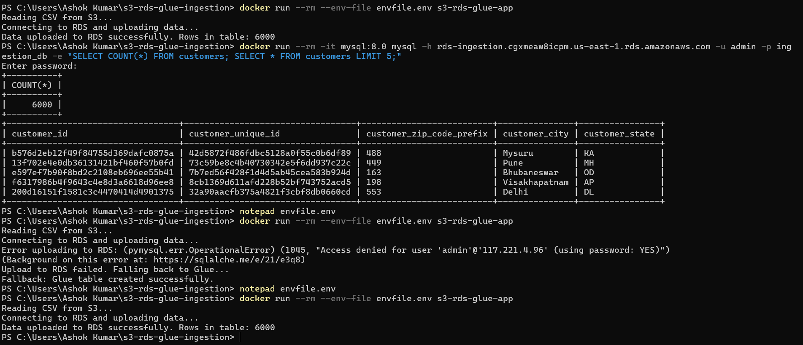
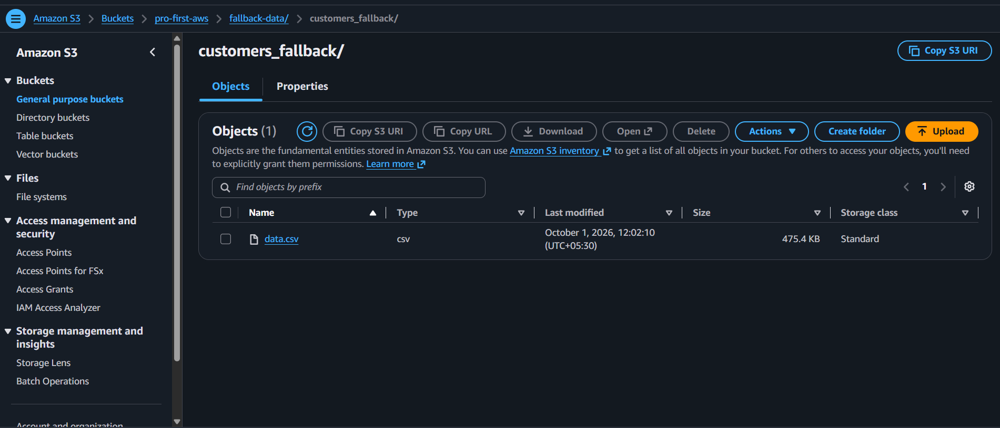
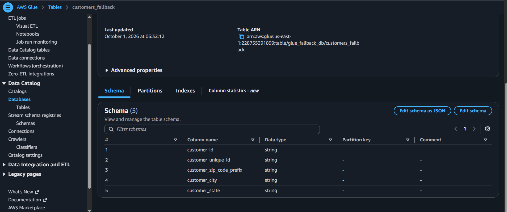
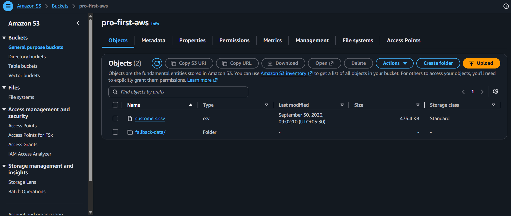

# S3 to RDS Ingestion Pipeline with AWS Glue Fallback

A Dockerized Python app that reads a CSV file from Amazon S3 and loads it into an Amazon RDS MySQL database. If the RDS load fails for any reason, the app saves a copy of the data back to S3 and registers it in the AWS Glue Data Catalog, so the data is never lost.

## Architecture

```
S3 (customers CSV)
      |
      v
Python app (Docker) ---- try first ----> RDS MySQL (customers table)
      |
      | if RDS fails
      v
AWS Glue Data Catalog (fallback table + backup file in S3)

IAM: a least-privilege policy controls access to S3 and Glue
```

## How it works

1. Reads the customers CSV from S3 with boto3 and pandas.
2. Tries to load it into RDS MySQL with SQLAlchemy and PyMySQL.
3. If the RDS load raises any error, it writes a copy of the CSV to an S3 `fallback-data/` folder and creates a Glue table that points to it.

## Tech used

Python, pandas, SQLAlchemy, PyMySQL, boto3, Docker, Amazon S3, Amazon RDS (MySQL), AWS Glue, IAM

## Project files

| File | Purpose |
|------|---------|
| `script.py` | Reads from S3, loads to RDS, falls back to Glue |
| `Dockerfile` | Packages the app |
| `requirements.txt` | Python dependencies |
| `envfile.env` | Credentials and settings (not committed to Git) |

## Run it

Create an `envfile.env` file with these values (use your own, never commit this file):

```
AWS_ACCESS_KEY_ID=
AWS_SECRET_ACCESS_KEY=
AWS_DEFAULT_REGION=us-east-1
S3_BUCKET_NAME=
CSV_FILE_KEY=
RDS_HOST=
RDS_USER=
RDS_PASSWORD=
RDS_DB_NAME=ingestion_db
RDS_TABLE_NAME=customers
GLUE_DB_NAME=glue_fallback_db
GLUE_TABLE_NAME=customers_fallback
GLUE_S3_PREFIX=fallback-data/
```

Then build and run:

```
docker build -t s3-rds-glue-app .
docker run --rm --env-file envfile.env s3-rds-glue-app
```

## Results

### 1. Normal run: data loaded into RDS



### 2. Data verified in MySQL



### 3. Forced failure: fallback to Glue

I changed the RDS password to a wrong value to simulate a failure. The app caught the error and switched to Glue on its own.



### 4. Glue Data Catalog table created by the fallback



### 5. Backup file saved in S3



## Security choices

- Credentials are passed in through an env file that is excluded from Git and from the Docker image.
- The IAM policy only allows what the pipeline needs (read and write on one bucket, plus the Glue actions it uses), instead of full-access managed policies.
- The RDS security group allows port 3306 only from my own IP, not from the whole internet.

## Problems I ran into and how I fixed them

- **IAM policy quota error:** too many managed policies were attached to my user. I removed them and replaced them with one custom least-privilege policy.
- **Connection timeout to RDS:** the database was not publicly accessible. I turned on public access and confirmed with `Test-NetConnection` on port 3306.
- **Unknown database error:** the initial database name was left empty when I created the instance. I created `ingestion_db` with a MySQL client running in Docker.
- **Invalid access key:** the key in my env file did not match a real key. I created a fresh one and updated the file.

## What I would add next

- Run the app on a schedule (for example with Airflow or EventBridge)
- Make the RDS instance private and run the container inside the VPC
- Add data validation before loading and logging to CloudWatch
